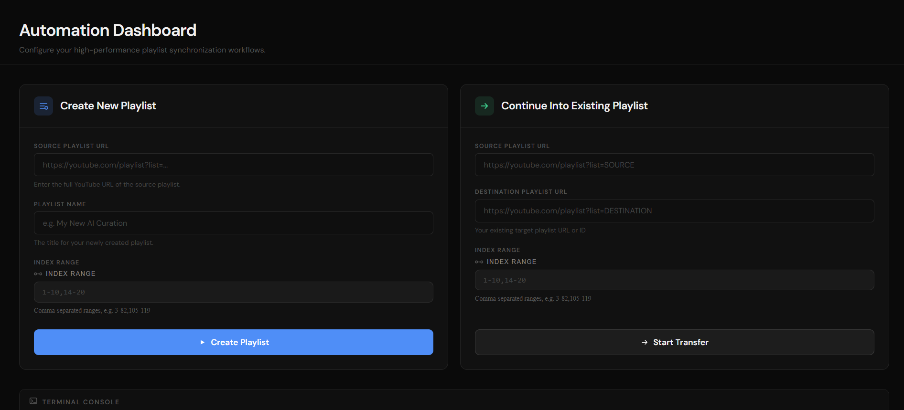

<div align="center">


<br/>
<br/>


<br/>
<br/>

**A full-stack automation tool for managing YouTube playlists using the YouTube Data API v3.**  
Create new playlists from video index ranges, append to existing ones, skip duplicates, and monitor all operations in real time through a built-in terminal console.

<br/>

</div>

---

## Table of Contents

- [Overview](#overview)
- [Features](#features)
- [Architecture](#architecture)
- [Project Structure](#project-structure)
- [Prerequisites](#prerequisites)
- [Installation](#installation)
- [YouTube API Setup](#youtube-api-setup)
- [Running Locally](#running-locally)
- [Usage Guide](#usage-guide)
- [Range Format](#range-format)
- [API Reference](#api-reference)
- [Deployment](#deployment)
- [Known Limitations](#known-limitations)

---

## Overview

YouTube Playlist Automator solves a specific problem: copying a precise subset of videos from one YouTube playlist into another — reliably, without duplicates, and with full visibility into what is happening at every step.

Operations are streamed from the Flask backend to the React frontend in real time using **Server-Sent Events (SSE)**. Each job is assigned a unique ID, so multiple operations can run concurrently without their log streams crossing.

---

## Features

- **Create New Playlist** — generate a fresh YouTube playlist from a defined index range of a source playlist
- **Append to Existing Playlist** — insert selected videos into an existing playlist, with automatic duplicate detection
- **Index Range Filtering** — select non-contiguous video ranges using a simple comma-separated format (e.g. `3-82,105-119`)
- **Duplicate Prevention** — fetches existing video IDs from the target before inserting; skips any already present
- **Quota Handling** — detects YouTube API quota exhaustion (HTTP 403) and logs resume instructions
- **Automatic Retries** — retries on HTTP 500/503 server errors with exponential backoff (up to 5 attempts)
- **Real-Time Logs** — all backend operations stream directly to an in-browser terminal console via SSE
- **Per-Job Streams** — each request receives a unique `job_id`, isolating log streams across concurrent operations
- **Private/Deleted Video Filtering** — automatically skips private or deleted videos during source playlist fetch

---

## Architecture

```
┌─────────────────────────────────┐        ┌──────────────────────────────────┐
│           Frontend              │        │            Backend               │
│      React + Vite + CSS         │        │         Python + Flask           │
│                                 │        │                                  │
│  CreateSection  ExistingSection │        │  POST /api/create                │
│       │               │        │──POST──▶  POST /api/existing              │
│       └──────┬────────┘        │        │       │                          │
│              │                 │        │       ▼                          │
│           Terminal             │        │  threading.Thread (daemon)        │
│              ▲                 │◀─SSE───│       │                          │
│              │                 │        │  queue.Queue (per job_id)         │
│         EventSource            │        │       │                          │
│    /api/stream/{job_id}        │        │  GET /api/stream/{job_id}        │
└─────────────────────────────────┘        │       │                          │
                                           │       ▼                          │
                                           │  YouTube Data API v3             │
                                           └──────────────────────────────────┘
```

---

## Project Structure

```
youtube-playlist/
│
├── backend/
│   ├── app.py                  # Flask routes, SSE streaming, job queue management
│   ├── playlist.py             # YouTube API logic — fetch, filter, insert, authenticate
│   ├── client_secrets.json     # OAuth 2.0 credentials (from Google Cloud Console)
│   ├── token.json              # Auto-generated after first OAuth login
│   └── requirements.txt        # Python dependencies
│
├── frontend/
│   ├── public/
│   ├── src/
│   │   ├── components/
│   │   │   ├── CreateSection.jsx     # Create new playlist form + submit logic
│   │   │   ├── ExistingSection.jsx   # Append to existing playlist form + submit logic
│   │   │   ├── RangeInput.jsx        # Text input for comma-separated index ranges
│   │   │   ├── Terminal.jsx          # SSE log consumer and display
│   │   │   ├── Icons.jsx             # SVG icon components
│   │   │   ├── Field.jsx             # Reusable labeled input component
│   │   │   └── Navbar.jsx            # Top navigation bar
│   │   ├── App.jsx                   # Root layout, log state, component composition
│   │   ├── main.jsx                  # React entry point
│   │   └── index.css                 # Global styles and CSS variables
│   ├── index.html
│   ├── package.json
│   └── vite.config.js
```

---

## Prerequisites

| Requirement | Version |
|---|---|
| Node.js | 18 or higher |
| Python | 3.9 or higher |
| Google Account | With YouTube Data API v3 enabled |

---

## Installation

**1. Clone the repository**

```bash
git clone https://github.com/your-username/youtube-playlist.git
cd youtube-playlist
```

**2. Install backend dependencies**

```bash
cd backend
pip install -r requirements.txt
```

**3. Install frontend dependencies**

```bash
cd frontend
npm install
```

---

## YouTube API Setup

This application requires OAuth 2.0 credentials from the Google Cloud Console.

**Step 1 — Create a Google Cloud Project**

Go to [console.cloud.google.com](https://console.cloud.google.com) and create a new project.

**Step 2 — Enable the YouTube Data API v3**

Navigate to **APIs & Services > Library**, search for `YouTube Data API v3`, and enable it.

**Step 3 — Create OAuth 2.0 Credentials**

Go to **APIs & Services > Credentials > Create Credentials > OAuth 2.0 Client ID**.  
Select **Desktop App** as the application type.  
Download the credentials file and rename it to `client_secrets.json`.  
Place it inside the `backend/` directory.

**Step 4 — First Run Authentication**

On the first run, a browser window will open for you to authorize the application.  
After authorization, a `token.json` file will be created automatically in `backend/`.  
Subsequent runs will use this token without requiring re-authorization.

---

## Running Locally

**Start the backend** (from the `backend/` directory):

```bash
python app.py
```

The Flask server starts at `http://localhost:5000`.

**Start the frontend** (from the `frontend/` directory, in a separate terminal):

```bash
npm run dev
```

The Vite dev server starts at `http://localhost:5173`.

---

## Usage Guide

**Create New Playlist**

1. Paste the source YouTube playlist URL into the **Source Playlist URL** field
2. Enter a name for the new playlist in the **Playlist Name** field
3. Enter the index range of videos to copy in the **Index Range** field
4. Click **Create Playlist**
5. Monitor progress in the terminal console at the bottom of the page

**Continue Into Existing Playlist**

1. Paste the source YouTube playlist URL into the **Source Playlist URL** field
2. Paste the destination playlist URL or ID into the **Destination Playlist URL** field
3. Enter the index range of videos to copy in the **Index Range** field
4. Click **Start Transfer**
5. The tool will automatically skip any videos already present in the destination

---

## Range Format

Index ranges are 1-based and correspond to the position of each video in the source playlist.

| Input | Result |
|---|---|
| `1-50` | Videos 1 through 50 |
| `3-82,105-119` | Videos 3–82 and videos 105–119 |
| `1-10,20-30,50-60` | Three separate ranges combined |

Ranges outside the total video count are automatically clamped to the last available video.  
Invalid format entries are rejected before the request is sent.

---

## API Reference

### POST `/api/create`

Creates a new YouTube playlist and inserts selected videos.

**Request body:**
```json
{
  "source": "https://youtube.com/playlist?list=PL...",
  "title": "My New Playlist",
  "description": "",
  "privacy": "private",
  "ranges": [[1, 50], [60, 80]]
}
```

**Response:**
```json
{
  "status": "started",
  "job_id": "uuid-v4-string"
}
```

---

### POST `/api/existing`

Appends selected videos into an existing playlist, skipping duplicates.

**Request body:**
```json
{
  "source": "https://youtube.com/playlist?list=PL...",
  "destination": "https://youtube.com/playlist?list=PL...",
  "ranges": [[3, 82], [105, 119]]
}
```

**Response:**
```json
{
  "status": "started",
  "job_id": "uuid-v4-string"
}
```

---

### GET `/api/stream/{job_id}`

Server-Sent Events stream for a specific job. Returns log entries until the job completes.

**Event format:**
```json
{ "type": "info" | "success" | "error" | "warn" | "data" | "done", "text": "..." }
```

---

### GET `/api/health`

Returns `{ "status": "ok" }`. Used to verify the backend is running.

---


## Known Limitations

| Limitation | Detail |
|---|---|
| YouTube API Quota | The YouTube Data API v3 has a daily quota of 10,000 units. Each video insertion costs approximately 50 units. Quota resets at midnight Pacific Time. |
| Render Free Tier | The free tier on Render sleeps after 15 minutes of inactivity. The first request after sleep takes approximately 30 seconds to respond. |
| OAuth on Server | The OAuth flow requires a browser for initial authorization. On a server, credentials must be pre-generated locally and supplied as environment variables. |
| Private Videos | Private and deleted videos in the source playlist are automatically skipped and not counted toward the index range. |

---

## Screenshots



---

<div align="center">

Built with the YouTube Data API v3 · Flask · React · Vite

</div>